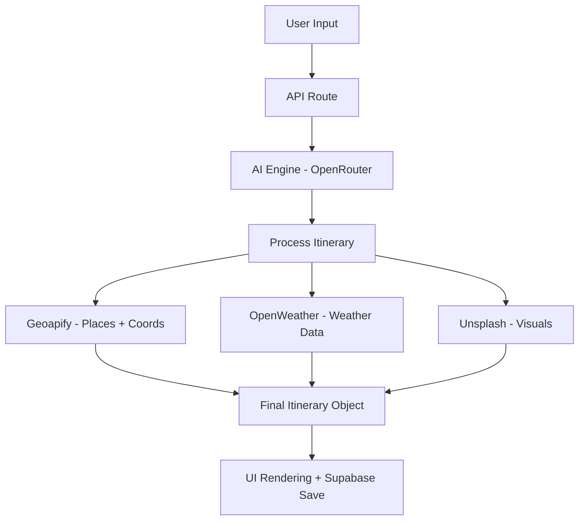

<div align="center">
  
  <h1>🌍 TripVerseAI — AI Travel Planner</h1>
  <p><strong>Your journey, intelligently crafted with AI.</strong></p>
  <p>
    <a href="#-features">Features</a> ·
    <a href="#-quick-start">Quick Start</a> ·
    <a href="#-architecture">Architecture</a> ·
    <a href="#-roadmap">Roadmap</a>
  </p>
</div>

---

## 🚀 Overview

TripVerseAI is a modern AI-powered travel planning platform that generates **personalized itineraries** based on your mood, budget, and preferences.

Unlike traditional travel apps, TripVerseAI focuses on:
- **Smart recommendations** 🧠
- **Hidden gem discovery** 💎
- **Real-time adaptability** 🌦️
- **Beautiful user experience** ✨

---

## ✨ Features

### 🧠 AI-Powered Planning
- Generate complete itineraries using AI
- Personalized based on mood, budget, duration

### 📅 Structured Itineraries
- Day-wise planning
- Time-based activities
- Smart flow of locations

### 📍 Location Intelligence
- Powered by Geoapify APIs
- Accurate places, routes, and maps

### 🌦️ Weather Integration
- Real-time weather using OpenWeather API
- Smart adjustments (indoor/outdoor plans)

### 💎 Hidden Gems Discovery
- Find less crowded, high-rated places
- Avoid tourist traps

### 💾 Save Itineraries
- Save trips for later
- View in dashboard

### 🧭 Explore Section
- Trending destinations
- Curated travel ideas

### 💸 Budget Optimization
- Estimate trip cost
- Smart budget-friendly suggestions

### 🎭 Mood-Based Travel
- Adventure, Romantic, Solo, Party
- AI adapts experience accordingly

---

## ⚡ Quick Start

### 1. Clone the repository
```bash
git clone https://github.com/rajatnagda45/TripVerseAI.git
cd TripVerseAI
```

### 2. Install dependencies
```bash
npm install
```

### 3. Set up environment variables
Create a `.env.local` file in the root directory:
```env
NEXT_PUBLIC_SUPABASE_URL=your_supabase_url
NEXT_PUBLIC_SUPABASE_ANON_KEY=your_supabase_anon_key
GEOAPIFY_API_KEY=your_geoapify_key
OPENROUTER_API_KEY=your_openrouter_key
OPENWEATHER_API_KEY=your_openweather_key
UNSPLASH_ACCESS_KEY=your_unsplash_key
```

### 4. Run the development server
```bash
npm run dev
```

Visit [http://localhost:3000](http://localhost:3000) to see the results.

---

## 🧱 Tech Stack

* **Frontend**: Next.js 14, React, TypeScript
* **Styling**: Tailwind CSS
* **Backend**: Next.js API Routes (Edge Runtime)
* **Database**: Supabase (Auth + PostgreSQL)
* **APIs Used**:
  * **Geoapify**: Maps + Places + Routing
  * **OpenRouter**: AI (LLM) processing
  * **OpenWeather**: Real-time atmospheric data
  * **Unsplash**: High-fidelity place imagery

---

## 🧠 Architecture



---

## 📁 Folder Structure

```
/public        → images, logo, fonts
/src/app       → pages & layouts (App Router)
/components    → UI components & logic
/lib           → utils, hooks, & core API logic
/services      → external API integrations
/types         → TypeScript interfaces
```

---

## 📈 Roadmap

* [x] AI Itinerary Generator
* [x] Interactive Dashboard
* [x] Pricing & Subscription Models
* [ ] AI Chat Assistant (beta)
* [ ] Trip Remix Feature
* [ ] Community Travel Feed
* [ ] Export to PDF
* [ ] Mobile Native App

---

## 👨‍💻 Author

**Rajat Nagda**  
© 2026 TripVerseAI. All rights reserved. Built with ❤️ by Rajat Nagda.

---

## 📜 License

MIT License

---

## ❤️ Support

If you like this project:
* ⭐ **Star** the repo
* 🍴 **Fork** it
* 🚀 **Share** it

---

**TripVerseAI — Explore smarter, travel better.**
